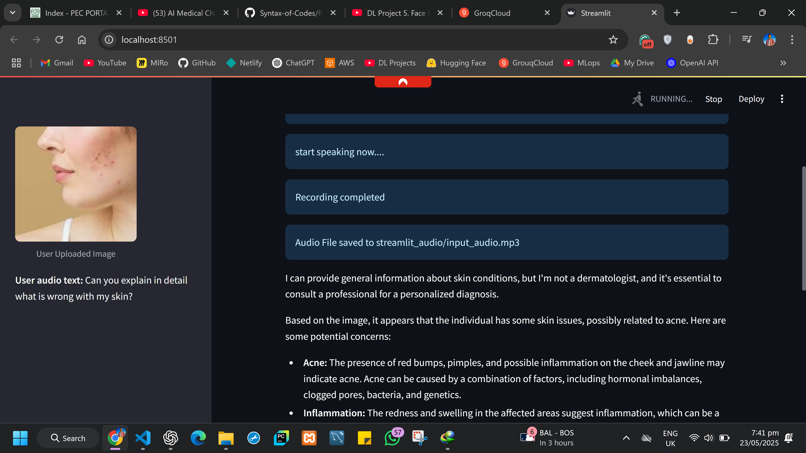
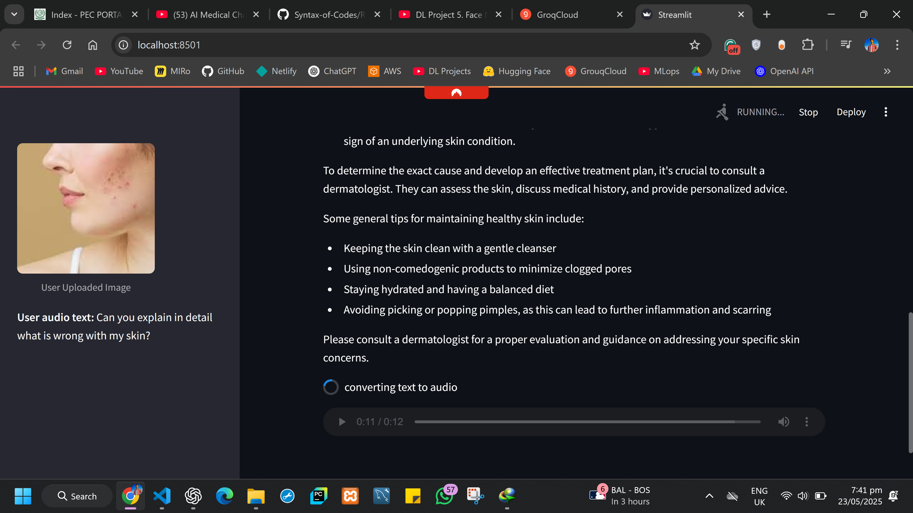
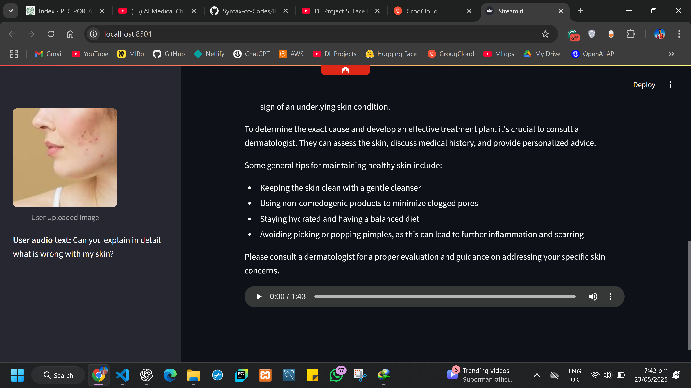
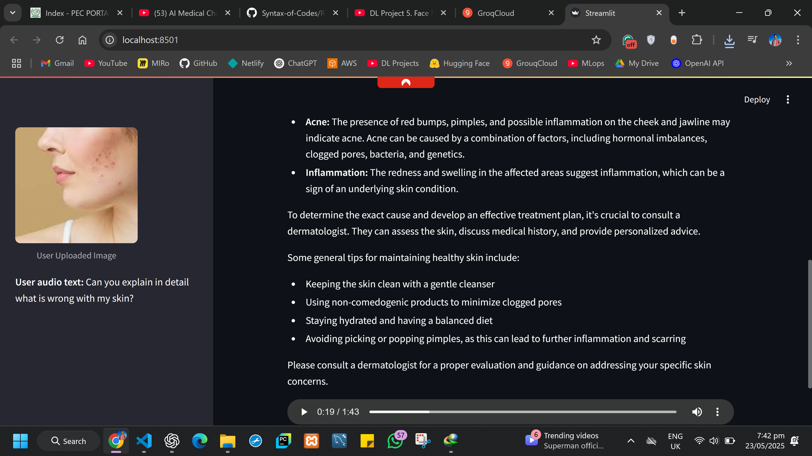

# 🧠 AI Medical Chatbot 2.0

A Streamlit-based AI medical assistant that accepts an image and a voice recording, processes both using Groq's LLM and Whisper APIs, and responds with medical advice in both text and speech form.

---







## 🚀 Features

- 📤 Uploads and displays a **medical image**
- 🎙️ Records **user voice input** and converts it to text via `Whisper-large-v3-turbo`
- 🧠 Sends both image and text to **Groq's LLaMA-4 Scout model**
- 🗣️ Converts the chatbot's reply into speech using **gTTS**
- 🔊 Supports inline audio playback in the Streamlit interface

---


## 📂 Project Structure

```

AI-Medical-Chatbot/
│
├─ app.py                    # Main Streamlit app
├── streamlit_audio/
│   └── ai.mp3                # AI-generated speech output
│   └── input_audio.mp3                # user input
|___notebook.ipynb       # complete code
├── requirements.txt   # Python dependencies
|__src/          component of notebook.ipynb 
└── README.md                 # This file

````

---

## 🛠️ Installation

### 1. Clone the Repository
```bash
git clone https://github.com/Haseeb1511/AI-Medical-Voice-Image-.git
cd AI-Medical-Voice-Image-
````

### 2. Create a Virtual Environment (Optional but Recommended)

```bash
python -m venv venv
venv\Scripts\activate
```

### 3. Install Dependencies

```bash
pip install -r requirements.txt
```

---

## 📦 Dependencies

``pip install -r requirements.txt``
```

Also install `ffmpeg` for `pydub` and microphone support:

* **Windows**: Add `ffmpeg` to PATH               # important


---

## 🧪 Usage

Run the Streamlit app:

```bash
streamlit run app.py
```

Then:

1. Upload a **medical image**
2. Click **Start Recording** and speak your query
3. The app will:

   * Display the transcribed voice text
   * Send image + text to the Groq model
   * Show model response
   * Play and show audio output

---

## 📌 Notes

* Windows PowerShell's `SoundPlayer` only supports `.wav` format. This script works around it with `gTTS` and `mp3` for Streamlit playback.
* For cross-platform playback in CLI (not Streamlit), you may use:

  * `afplay` for macOS
  * `mpg123` for Linux
  * PowerShell for Windows

---


---

## 📬 Contact

Made with ❤️ by \[Haseeb Manzoor]

```

